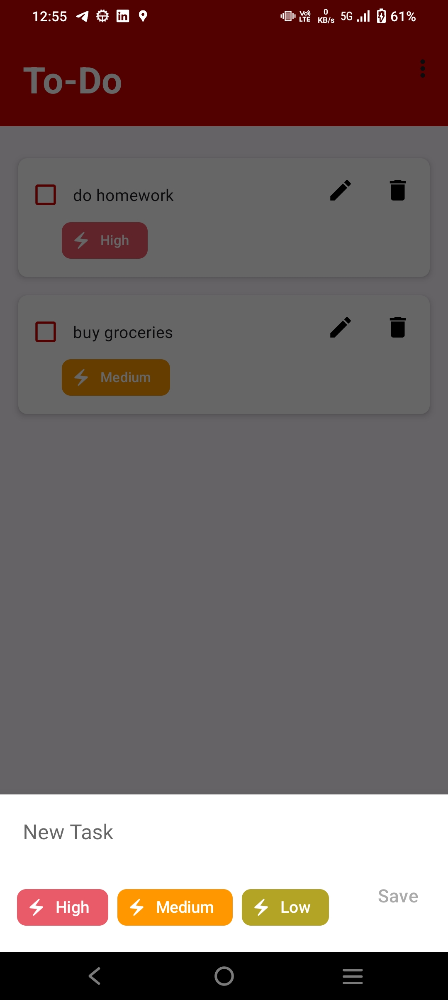
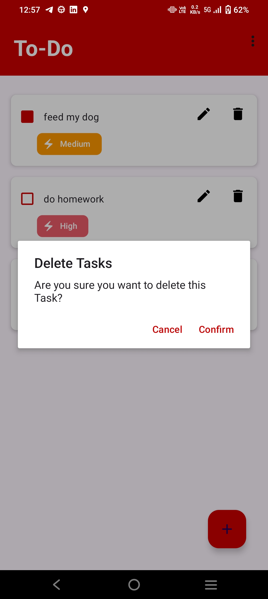

This is a ToDo app developed usin android studio with Kotlin.
It has features like adding new task,setting up its priority,editing and deleting te task.
You can also mark the task checked.
 

 

 

